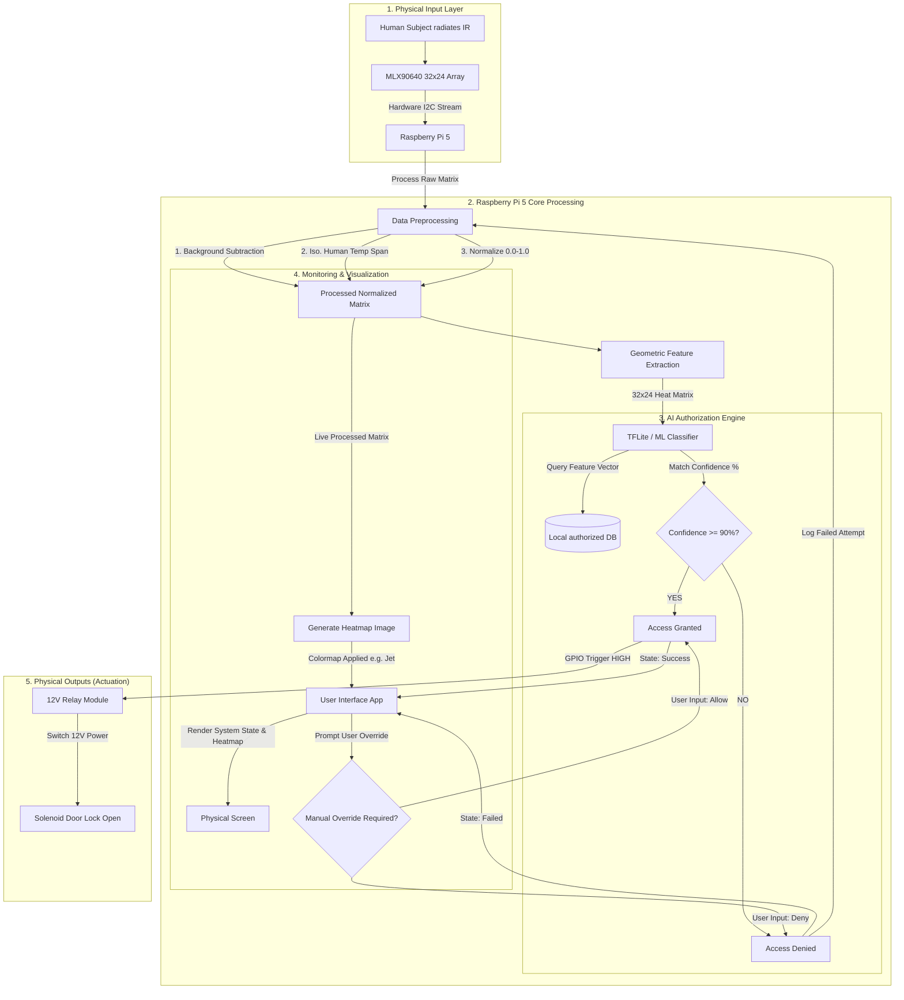

# Thermal Authorization System Architecture

This repository contains the software and machine learning pipeline for our privacy-focused thermal authorization system using the MLX90640 sensor and Raspberry Pi 5.

## System Block Diagram

